<p align="center">
  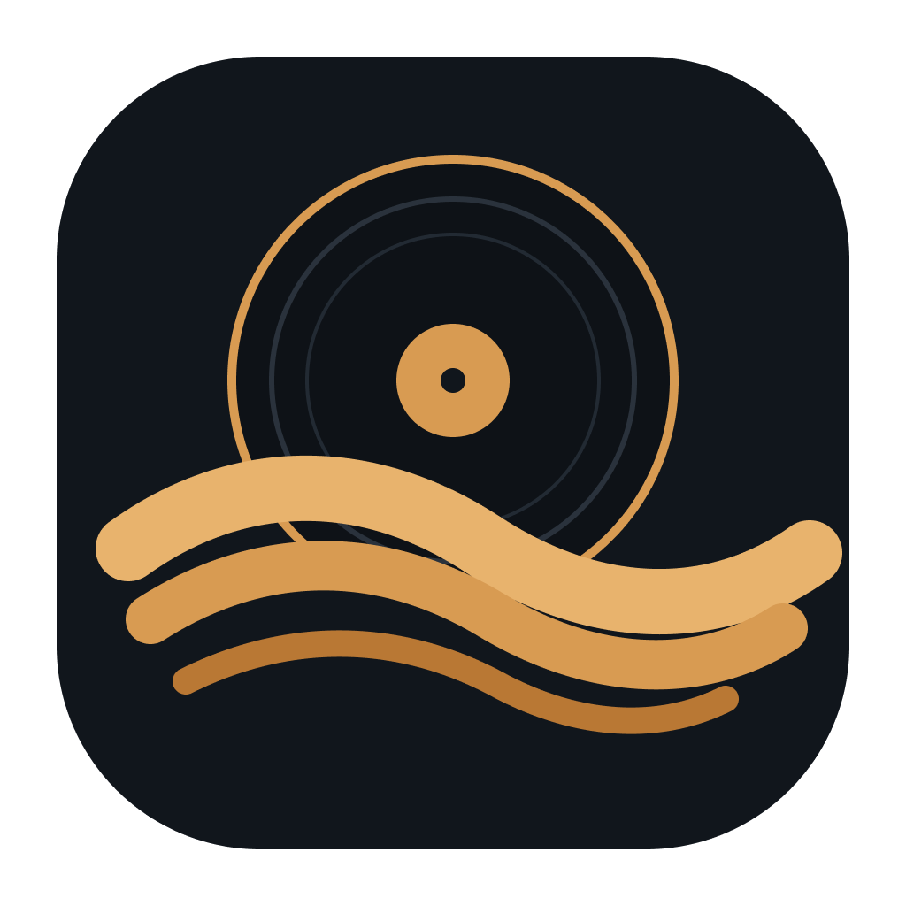
</p>

<h1 align="center">Sazanami</h1>

<p align="center">
  <strong>An offline, privacy-first Android music player for your own music library.</strong>
</p>

<p align="center">
  
  
  
</p>

<p align="center">
  <a href="https://github.com/rsgarrido/sazanami/releases/latest"><strong>Download latest APK</strong></a>
  ·
  <a href="https://github.com/rsgarrido/sazanami/releases">All releases</a>
</p>

---

## Sazanami

Sazanami is a local Android music player built for people who own and manage their own music files.

It combines a modern music library with deeply customizable player interfaces, nostalgic hardware-inspired themes, multiple persistent queues, Smart Playlists, real file-tag editing, listening statistics, local lyrics, audio tools, Android Auto, and home-screen widgets.

Sazanami is designed around local playback and privacy. Your music library does not require a streaming service or an account, and Sazanami does not track or sell your listening data.

## Highlights

- **Your local music library** — Browse songs, albums, artists, playlists, folders, and genres with sorting, filtering, ratings, favorites, search, and recently played/added views.
- **Six player experiences** — Choose between the customizable Sazanami Default player and five retro-inspired interfaces.
- **Multiple persistent queues** — Create, rename, switch between, preview, and reorder separate playback queues without losing your place.
- **Manual and Smart Playlists** — Build traditional playlists or create rule-based collections using metadata, ratings, listening history, dates, play counts, and more.
- **Real metadata editing** — Edit supported tags and artwork directly in your music files rather than maintaining app-only metadata.
- **Advanced audio tools** — Graphic and parametric equalization, ReplayGain, crossfade, album-transition preservation, audio offload, waveform seeking, and a sleep timer.
- **Listening statistics** — Explore listening time, play counts, trends, top tracks, artists, and albums across configurable time ranges.
- **Local lyrics** — Use your own `.lrc` files with synchronized line-by-line playback.
- **Android integration** — Background playback, notification and lock-screen controls, Bluetooth/media buttons, Android Auto, and resizable home-screen widgets.
- **Backup and restore** — Export and restore supported Sazanami library data, history, ratings, playlists, preferences, and other app state.

## Player Themes

Sazanami includes six expanded-player designs built on the same playback system. Each has its own mini player, interactions, visual identity, and transition into the full player.

<table>
  <tr>
    <td align="center" valign="top">
      <strong>Sazanami Default</strong><br><br>
      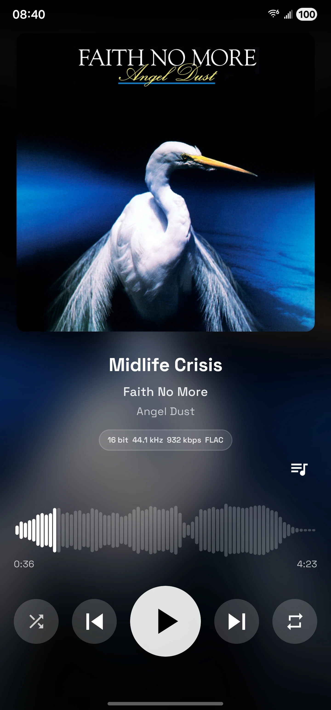<br><br>
      Highly customizable
    </td>
    <td align="center" valign="top">
      <strong>Classic Wheel</strong><br><br>
      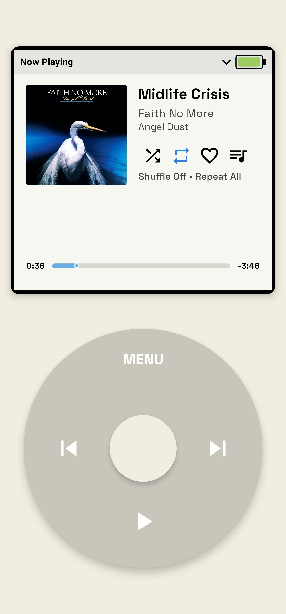<br><br>
      Wheel-driven portable-player interface
    </td>
    <td align="center" valign="top">
      <strong>Retro Rack</strong><br><br>
      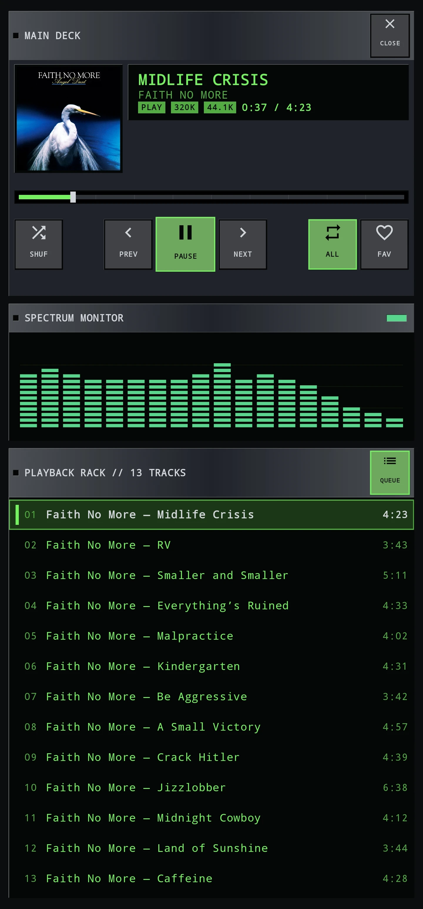<br><br>
      Rack-style player with a live spectrum and queue
    </td>
  </tr>
  <tr>
    <td align="center" valign="top">
      <strong>Pocket Flip</strong><br><br>
      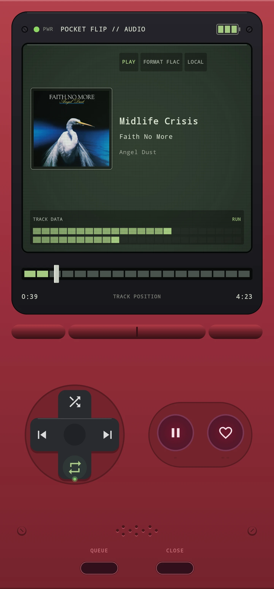<br><br>
      Handheld-inspired controls and reactive track data
    </td>
    <td align="center" valign="top">
      <strong>Pocket Cassette</strong><br><br>
      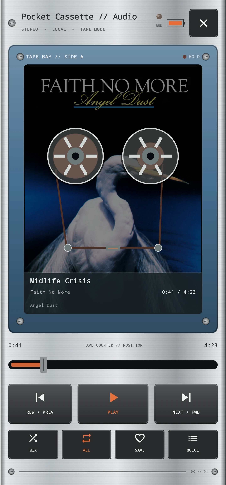<br><br>
      Cassette-inspired reels, tape motion, and transport controls
    </td>
    <td align="center" valign="top">
      <strong>Pocket Disc</strong><br><br>
      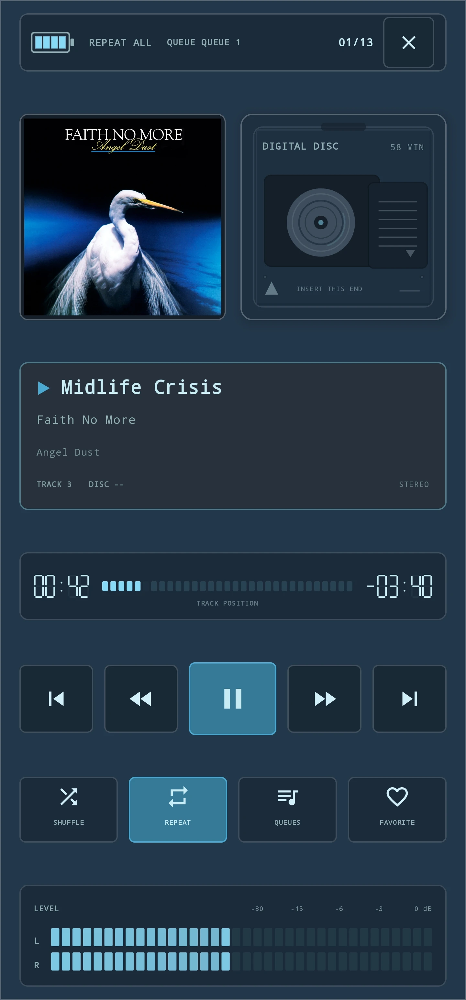<br><br>
      Digital portable-player layout with reactive levels
    </td>
  </tr>
</table>

### Make the Default player yours

The Sazanami Default player can be customized with different artwork layouts, seekbar styles, waveform density, backgrounds, progress colors, artwork shape and sizing, control styles, metadata alignment, layout density, and more.

Retro themes also provide their own configurable color schemes.

<p align="center">
  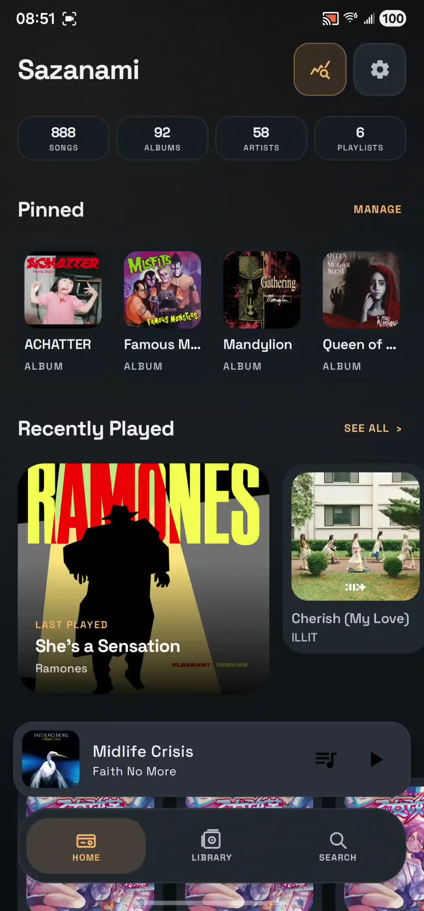
</p>

Player transitions are interactive rather than simple screen changes. Artwork and selected interface elements move between the mini player and expanded player as you drag.

## Explore Sazanami

### Home and Library

Quickly return to pinned music, recently played tracks, recently added music, and favorites from Home, then browse and manage the full library through Songs, Albums, Artists, Playlists, Folders, and Genres.

<p align="center">
  
  &nbsp;&nbsp;
  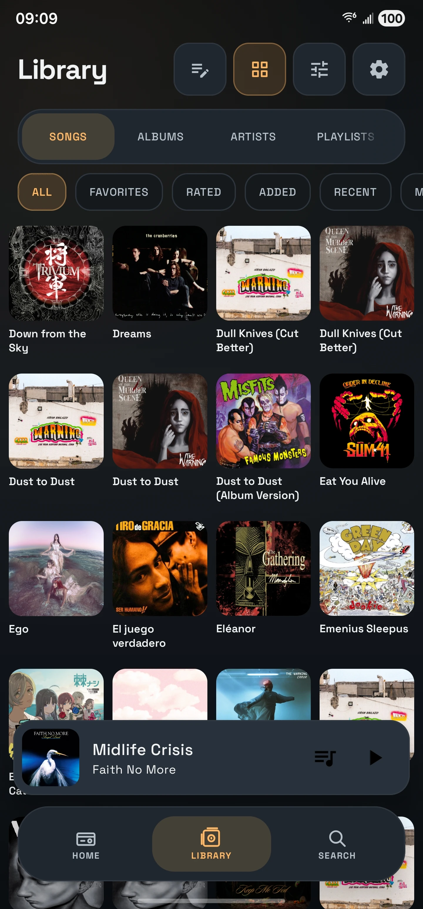
</p>

### Albums and Playlists

Album pages combine large artwork, album metadata, technical audio information, playback actions, and the full track listing.

Manual playlists support custom ordering and artwork, while Smart Playlists can build dynamic collections from rules based on metadata, ratings, listening history, play counts, dates, and more.

<p align="center">
  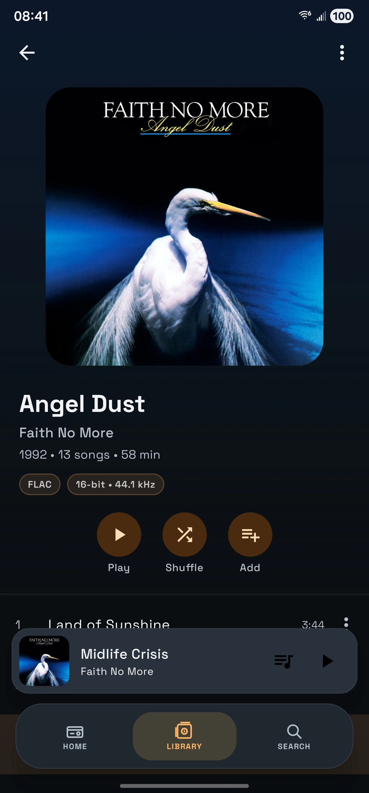
  &nbsp;&nbsp;
  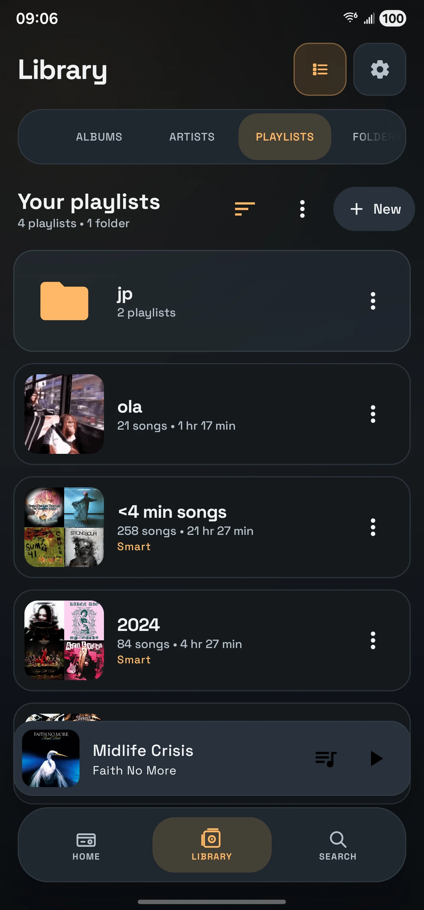
</p>

### Smart Playlists

Build reusable rules, choose how matching songs are sorted, optionally limit the result count, and preview the matches before saving.

<p align="center">
  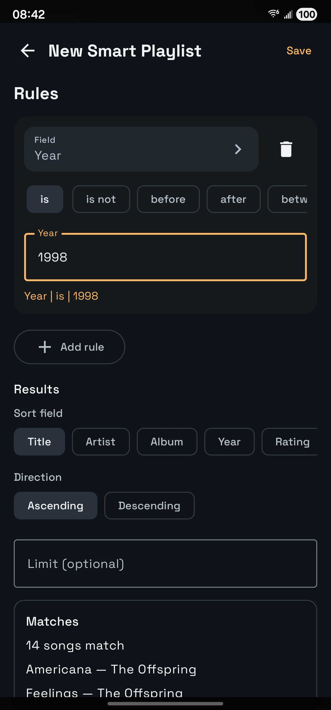
</p>

### Multiple Queues

Sazanami is not limited to one temporary playback queue.

Create and name multiple queues, preview another queue before switching to it, reorder upcoming songs, and return to a queue with its playback state preserved.

<p align="center">
  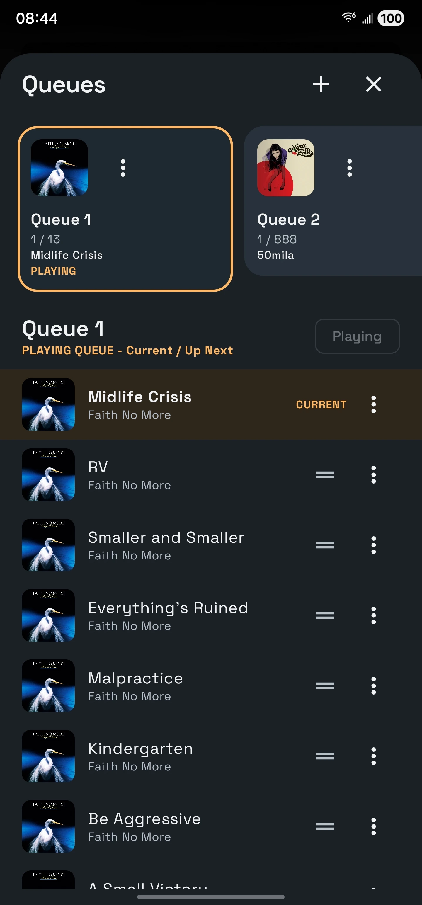
</p>

### Listening Statistics

Track how you listen over Today, 7 days, 30 days, This month, This year, All time, or a custom range.

See recorded listening time, qualified plays, completion counts, trends, and your top tracks, artists, and albums.

<p align="center">
  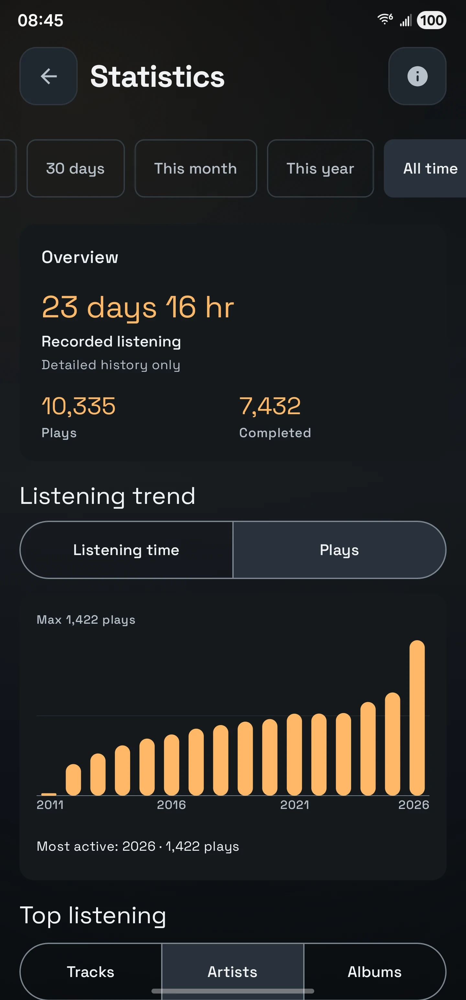
  &nbsp;&nbsp;
  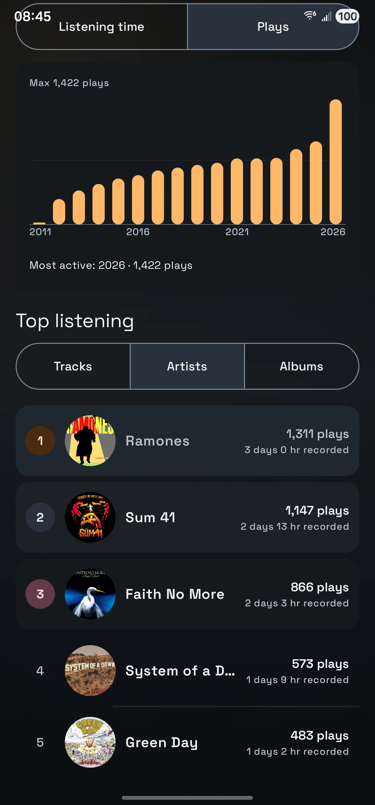
</p>

### Equalizer

Sazanami includes Graphic and Parametric EQ modes with presets, import/export support, configurable preamp, automatic headroom, response analysis, and an optional sample-peak limiter.

<p align="center">
  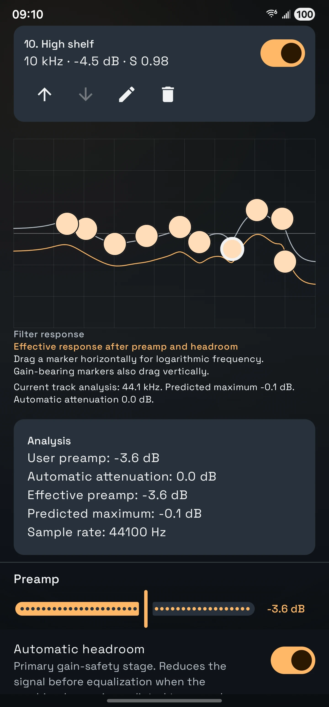
</p>

### Edit Your Music Files

Edit supported metadata such as title, artist, album, album artist, date/year, genre, composer, publisher, BPM, disc information, comments, copyright, and artwork.

Changes are written to supported music files instead of existing only inside Sazanami.

<p align="center">
  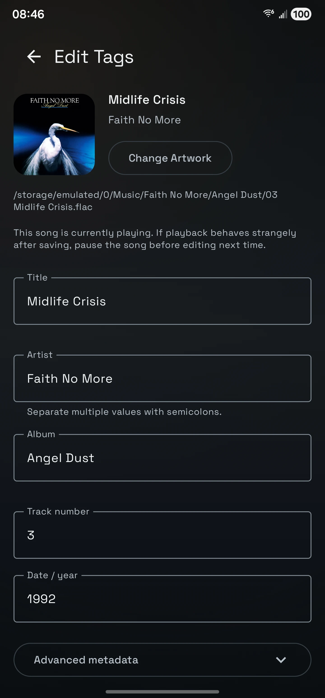
</p>

### Home Screen Widgets

Sazanami provides resizable widgets with Previous, Play/Pause, and Next controls.

Widget appearances can follow the current player theme or use Sazanami Default, System/Dynamic, Retro Rack, Pocket Cassette, Classic Wheel, Pocket Flip, or Pocket Disc styling.

<p align="center">
  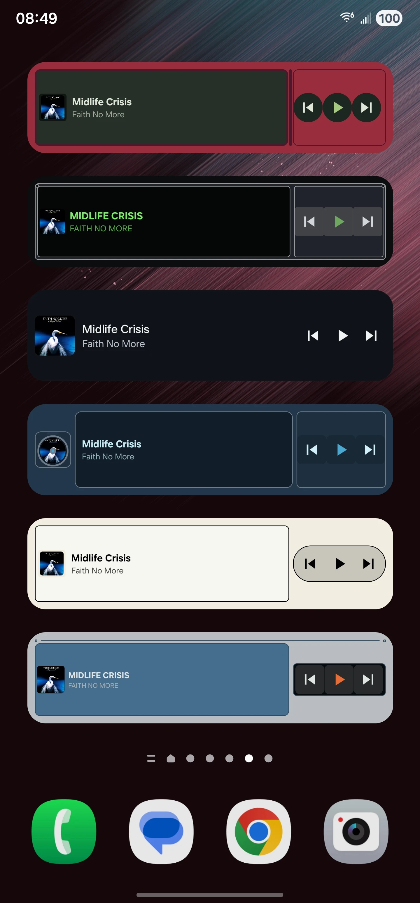
</p>

## Privacy and Offline Use

Sazanami is built around music stored on your device.

- No Sazanami account is required.
- No streaming subscription is required.
- Your listening history and library data are stored locally.
- Sazanami does not track your listening for advertising or sell your listening data.
- Local artwork, metadata, lyrics, playlists, ratings, queues, and statistics are managed as part of your own library experience.

Sazanami intentionally focuses on local music ownership rather than turning your library into another online service.

## Feature Overview

<details>
<summary><strong>Library and organization</strong></summary>

- Songs, Albums, Artists, Playlists, Folders, and Genres
- List and grid views
- Library sorting and filtering
- Favorites
- 1–5 star ratings
- Recently Added
- Recently Played
- Most Played
- Search across songs, albums, artists, and playlists
- Up to four pinned Home items
- Custom artist pictures
- Playlist artwork and automatic collages
- Playlist folders
- M3U import and M3U8 export

</details>

<details>
<summary><strong>Playback and queues</strong></summary>

- Background playback
- Previous / Next
- Play / Pause
- Shuffle
- Repeat Off / All / One
- Play Next
- Add to current queue
- Add to another queue
- Play in a new queue
- Multiple named persistent queues
- Queue reordering
- Playback-position restoration
- Crossfade
- Album-transition preservation
- Smooth play/pause
- ReplayGain
- Audio offload when compatible
- Sleep timer

</details>

<details>
<summary><strong>Playlists</strong></summary>

- Manual Playlists
- Smart Playlists
- Smart Playlist rules based on listening behavior, metadata, and library/file information
- Match-all / match-any rule behavior
- Sort field and direction
- Optional song limits
- Live result preview
- Generated playlist suggestions
- Playlist folders
- Custom ordering for manual playlists
- Playlist artwork
- M3U import
- M3U8 export

</details>

<details>
<summary><strong>Audio and lyrics</strong></summary>

- Graphic equalizer
- Parametric equalizer
- EQ presets
- EQ text/file import and export
- Preamp control
- Automatic headroom
- Sample-peak limiter
- A/B EQ comparison
- ReplayGain
- Waveform seeking
- Local `.lrc` lyrics
- Synced line-by-line lyrics
- Lyrics folder scanning

</details>

<details>
<summary><strong>Personalization</strong></summary>

- Six player themes
- Four Default-player presets
- Multiple artwork-transition styles
- Seekbar and waveform customization
- Artwork sizing, shape, fit, and shadow
- Background styles and blur controls
- Playback-control styles and sizing
- Metadata alignment and layout density
- Album-derived colors
- Custom retro-theme colors
- Sazanami / Space Grotesk font
- Device-default font
- Theme-aware mini players
- Theme-specific player transitions
- Multiple home-screen widget styles

</details>

<details>
<summary><strong>Listening history and statistics</strong></summary>

- Listening-time tracking
- Qualified play counts
- Completion counts
- Listening trends
- Top tracks
- Top artists
- Top albums
- Multiple date ranges
- Custom date range
- Spotify Extended Streaming History import
- Manual matching between imported history and local tracks

</details>

<details>
<summary><strong>Android integration</strong></summary>

- Media notification
- Lock-screen controls
- Bluetooth/headset media controls
- Background Media3 playback service
- Android Auto browsing and playback
- Home-screen widgets
- Playback restoration

</details>

## Download and Installation

### GitHub Releases

Stable Sazanami APKs are distributed through GitHub Releases.

**[Download the latest release](https://github.com/rsgarrido/sazanami/releases/latest)**

Sazanami requires **Android 8.0 (API 26) or newer**.

To install:

1. Download the latest Sazanami APK from GitHub Releases.
2. Open the downloaded APK on your Android device.
3. If Android asks, allow your browser or file manager to install apps from that source.
4. Install Sazanami.
5. Open the app and grant access to the music you want Sazanami to use.

### Updating

Install a newer Sazanami release APK over the existing installation.

Backups are still recommended before major updates or when moving to another device.

## Technology

Sazanami is primarily written in **Kotlin** and uses **Jetpack Compose** and **Material 3** for its interface.

Core technologies include:

- **Media3 / ExoPlayer** — playback, MediaSession integration, background audio, and Android Auto
- **Room** — playlists, listening history, ratings, persistent queues, and other structured app data
- **DataStore** — application preferences
- **Jetpack Glance** — Android home-screen widgets
- **MediaStore and Storage Access Framework** — local library and user-selected file/folder access
- **C++ / Android media APIs** — offline waveform analysis

Sazanami uses a `MediaLibraryService` so playback and external controls remain independent of the main Compose UI.

## Building from Source

Clone the repository:

```bash
git clone https://github.com/rsgarrido/sazanami.git
cd sazanami
```

Open the project in Android Studio and allow Gradle to synchronize the project.

For a local debug build:

```bash
./gradlew assembleDebug
```

On Windows:

```powershell
.\gradlew.bat assembleDebug
```

## Documentation

Additional technical documentation will be added under [`docs/`](docs/).

The repository also maintains internal architecture/status documentation used during development and technical audits.

## Feedback and Issues

Bug reports and feature suggestions are welcome through GitHub Issues.

## License

Sazanami is licensed under the **GNU General Public License v3.0**.

See [`LICENSE`](LICENSE) for the full license text.

Bundled fonts and third-party resources retain their respective licenses.

## Acknowledgements

Sazanami is built with open-source Android technologies and libraries including Jetpack Compose, AndroidX Media3, Room, Glance, Coil, and Jaudiotagger.

The default Sazanami typeface is **Space Grotesk**, distributed under the Open Font License.

Some player designs are inspired by the visual language of classic portable music hardware and desktop media players. Sazanami is an independent project and is not affiliated with the manufacturers or developers of those products.